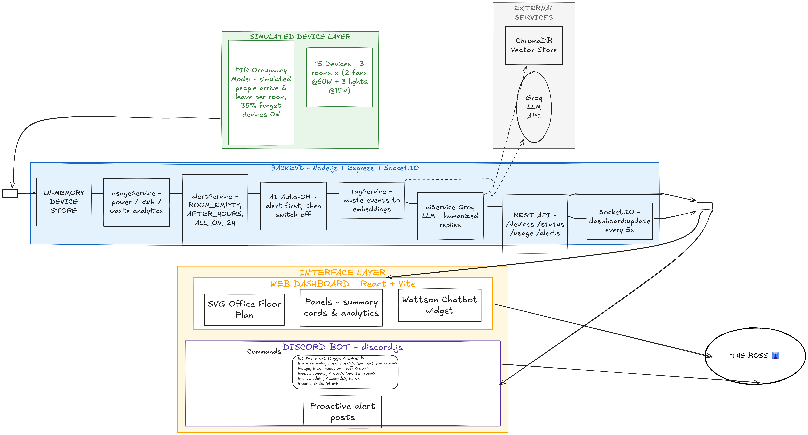
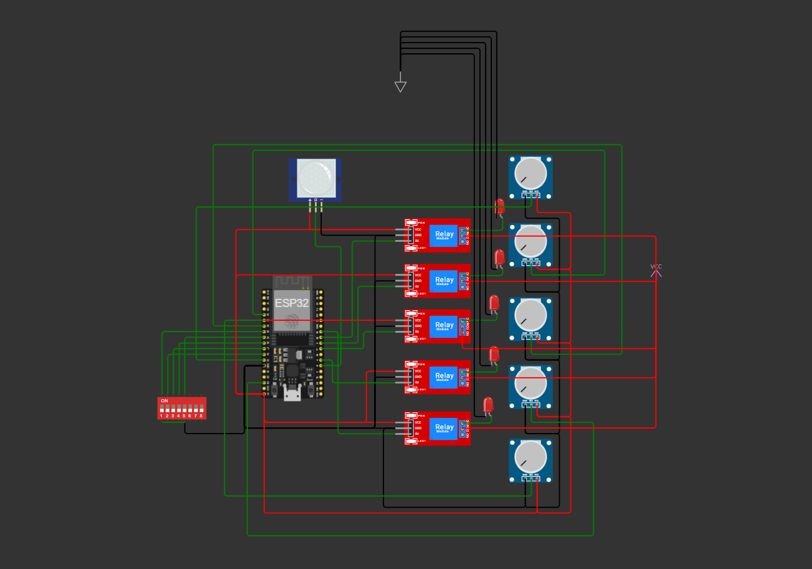

# ⚡ Lights, Fans, Discord: The Boss's Big Idea

A complete office electricity monitoring system: a simulated device layer, one shared
backend API, a real-time web dashboard, and a Discord bot — all reading from a **single
source of truth**.

> 📌 **Note on device count:** the office has 3 rooms × (2 fans + 3 lights) = **15 devices**
> (6 fans + 9 lights). Some copies of the brief say "18 devices" — that's an arithmetic slip;
> this system derives every count dynamically from the device store, so nothing is hardcoded.

## 🧩 Problem Summary

People keep leaving lights and fans running after work and the electricity bill keeps
climbing. The boss wants to (1) see every device live on a dashboard, (2) check power usage,
and (3) ask a bot about it right from Discord. No real hardware — device data is simulated.

## ✨ Features

- **PIR occupancy simulation** — rooms have simulated people; a PIR sensor senses presence.
  Devices change on human timescales (arrivals, departures, forgetfulness), not random strobing
- **AI auto-off** — when PIR reports a room empty with devices ON, an **alert fires first**
  (dashboard + Discord), then after a **configurable delay (dashboard slider, 5s–10min)** the
  AI switches everything off and logs the waste
- **Waste analytics** — per room: energy used vs **wasted** (empty room burning power),
  split **office-hours vs after-hours**, plus which room lingers longest after 5 PM
- **ChromaDB RAG** — every waste episode is stored as a document in a Chroma vector store
  (automatic fallback to a local JSON log), queryable from the site and the bot (`!ask`)
- **Live dashboard** with a top-view office floor plan (sofa, desks, doors, corridor, plants —
  modelled on the brief's layout): 💡 lights glow, 🌀 fans spin, occupied rooms show people,
  alert rooms pulse red *(bonus)*
- **Click any device on the map to toggle it** + PIR demo buttons (simulate someone
  entering/leaving) — great for demos *(bonus)*
- **REST API + Socket.IO real-time stream** — zero page refreshes
- **Live power meter** (total watts + per-room breakdown + highest consuming room + est. kWh today)
- **Timestamped alerts**: room empty with devices ON, devices ON after office hours,
  room fully ON for 2+ hours
- **Discord bot** (`!status`, `!room`, `!usage`, `!alerts`, `!waste`, `!ask`) answering from the same backend
- **AI-humanized bot replies via Groq LLM** — friendly, conversational, never robotic *(bonus)*
- **Proactive Discord alerts** — the bot pushes new alerts to a channel the moment they trigger *(bonus)*

## 🛠 Tech Stack

| Layer | Tech |
|---|---|
| Backend | Node.js, Express, Socket.IO, CORS, dotenv |
| Frontend | React 18 + Vite, Socket.IO client, custom CSS (SVG floor plan) |
| Discord bot | discord.js (v13/v14 compatible), axios, socket.io-client, Groq API (LLM) |
| Data | In-memory store (single source of truth) |
| RAG | ChromaDB vector store (optional) + local JSON fallback, hashed bag-of-words embeddings |

## 🏗 Architecture

```
[Simulated Device Layer]  (simulator.js — biased random toggles every 5s)
          │ mutates
          ▼
[In-memory Device Store]  (devices.js — THE single source of truth)
          │
          ├── usageService.js  → power & kWh calculations
          ├── alertService.js  → after-hours / all-on-2h alert rules
          ▼
   [Express REST API + Socket.IO]  (port 5000)
          │                              │
   HTTP + WebSocket              HTTP + WebSocket
          ▼                              ▼
 [React Dashboard :5173]        [Discord Bot]
   live floor plan, meter,        !status !room !usage !alerts
   alerts — no refresh            + proactive alert posts (Groq-humanized)
```

**System diagram:** 
**Circuit schematic (Wokwi):**  — ESP32-based sensing circuit for one representative room
**Demo video:** [Watch the 3-minute demo](PASTE_GOOGLE_DRIVE_LINK_HERE) *(set Drive sharing to "Anyone with the link → Viewer")*

## 🚀 How to Run

Requires Node.js 18+. Three terminals, in this order:

### 1. Backend

```bash
cd backend
cp .env.example .env
npm install
npm start          # ⚡ http://localhost:5000
```

### 2. Frontend

```bash
cd frontend
cp .env.example .env
npm install
npm run dev        # 📊 http://localhost:5173
```

### 3. Discord bot

```bash
cd bot
cp .env.example .env   # fill in DISCORD_TOKEN (+ optional GROQ_API_KEY, DISCORD_ALERT_CHANNEL_ID)
npm install
npm start
```

> **Discord setup:** create an app at https://discord.com/developers/applications, add a bot,
> enable the **Message Content Intent**, copy the token into `bot/.env`, and invite the bot to
> your server with *Send Messages* + *Read Message History* permissions. For proactive alerts,
> right-click a channel → *Copy Channel ID* (enable Developer Mode) into `DISCORD_ALERT_CHANNEL_ID`.

> **Groq setup (AI replies):** grab a free API key from https://console.groq.com and set
> `GROQ_API_KEY` in `bot/.env`. Without a key the bot still works with friendly template replies.

## 📡 API Documentation

Base URL: `http://localhost:5000`

| Method | Endpoint | Description |
|---|---|---|
| GET | `/api/health` | Backend status, uptime, device count |
| GET | `/api/devices` | All devices (id, name, type, room, status, powerRating, currentPower, lastChanged) |
| GET | `/api/devices/grouped` | Devices grouped by room |
| POST | `/api/devices/:id/toggle` | Manually toggle one device (demo) |
| GET | `/api/status` | Room-wise summary: fans/lights ON, devices ON/OFF, power |
| GET | `/api/usage` | `totalPowerNow`, `estimatedTodayKwh`, `perRoomUsage`, `highestConsumingRoom` |
| GET | `/api/alerts` | Active alerts (id, type, room, message, severity, timestamp) |
| GET | `/api/rooms/:roomKey` | One room's summary + devices. Keys: `drawing`, `work1`, `work2` |
| POST | `/api/rooms/:roomKey/occupancy` | Simulate the PIR sensor: `{ "occupied": true\|false }` |
| GET | `/api/waste` | Per-room used vs wasted energy (office/after-hours split), after-hours lingering, top consumer/waster, recent waste events |
| GET | `/api/waste/events` | Recent raw waste events from the RAG log |
| GET | `/api/rag/query?q=...` | RAG retrieval: most relevant waste events for a question |
| GET | `/api/settings` | Current AI auto-off settings |
| POST | `/api/settings` | `{ "aiEnabled": bool, "autoOffDelaySeconds": 5–3600 }` (dashboard slider) |
| POST | `/api/rooms/:roomKey/devices` | Switch a whole room: `{ "status": "on"\|"off" }` |
| GET | `/api/ai/status` | Is the Groq LLM configured? |
| POST | `/api/ai/humanize` | `{ facts, fallback }` → friendly LLM rewrite (used by the bot) |
| POST | `/api/ai/chat` | `{ sessionId?, message }` → Wattson chat turn grounded in live data + RAG |
| POST | `/api/ai/chat/end` | `{ sessionId }` → end a chat session |

Socket.IO events emitted after every simulation tick / manual toggle:
`devices:update`, `usage:update`, `alerts:update`, and `dashboard:update`
(payload: `{ devices, groupedDevices, status, usage, alerts }`).

## 🤖 Discord Commands

| Command | What it does |
|---|---|
| `!status` | Friendly summary of all rooms + total live wattage |
| `!room drawing` / `!room work1` / `!room work2` | Fans/lights ON, power, and device list for that room |
| `!usage` | Total power now, estimated kWh today, highest consuming room |
| `!alerts` | Active alerts (or a friendly "all clear") |
| `!waste` | Energy used vs wasted per room, office vs after-hours, top waster |
| `!report` | Full combined report (status + usage + waste) |
| `!ask <question>` | RAG: retrieves stored waste events (ChromaDB/log) and answers with Groq |
| `!chat` | Start a chat session with **Wattson**, the office energy AI — then just type normally |
| `!endchat` | End your chat session |
| `!toggle <deviceId>` | Flip one device, e.g. `!toggle work2-fan-1` |
| `!on <room>` / `!off <room>` | Switch ALL devices in a room |
| `!occupy <room>` / `!vacate <room>` | Simulate the PIR sensor (great for demoing the AI auto-off) |
| `!delay <seconds>` | Set the AI auto-off delay (5–3600) |
| `!ai on\|off` | Enable/disable the auto-off AI |
| `!help` | Command list |

All responses are generated from **live backend data** — nothing is hardcoded.

**Where the AI lives:** the Groq LLM is called by the **backend** (`/api/ai/*`), so set
`GROQ_API_KEY` in **`backend/.env`** — that one key powers the Discord bot's friendly replies,
the proactive alerts, `!chat`, `!ask` AND the website chatbot. (A key in `bot/.env` still works
as a local fallback.) The backend logs every Groq call (`🧠 Groq ... ok/FAILED`) so you can see
exactly when the LLM is used.

## 💬 Website Chatbot ("Wattson")

Floating chat button (bottom-right of the dashboard). The boss can discuss **usage, wastage,
room stats and alerts** in natural language. Every answer is grounded in the live store +
RAG-retrieved waste history — same source of truth as everything else. Sessions are held
in memory with a 30-min TTL; the **end chat** button (or Discord `!endchat`) closes a session.

## 🎲 Simulation Logic (PIR occupancy model)

- 15 devices are created at startup with predictable ids (`drawing-fan-1` … `work2-light-3`).
- Each room has simulated **people**, sensed by a **PIR sensor**. Occupancy changes on
  realistic timescales: during office hours (9–5) rooms are usually occupied (~25 min stays,
  ~6 min gaps); after hours only the occasional late worker shows up.
- **Arriving** people gradually switch on the devices they need (all 5 during office hours,
  2–3 after hours). **Leaving** people usually switch things off — but **35% of the time they
  forget** and leave devices running. That's the waste this system exists to catch.
- When PIR reports a room **empty with devices ON**: ① a `ROOM_EMPTY` alert fires immediately
  (dashboard + Discord), ② the room's power draw starts counting as **wasted** energy,
  ③ after the configured delay the **AI switches everything off** and the episode is written
  to the ChromaDB RAG store.
- Every 5s tick integrates energy per room into used/wasted buckets, split office/after-hours,
  and broadcasts all Socket.IO events.
- `SIM_SPEED` in `backend/.env` speeds up occupancy changes for demos (e.g. `SIM_SPEED=10`).

## 🚨 Alert Rules

| Type | Condition | Severity |
|---|---|---|
| `ROOM_EMPTY` | PIR: room empty but devices still ON (AI auto-off countdown running) | warning |
| `AFTER_HOURS` | A room has devices ON outside 9 AM–5 PM | warning |
| `ALL_ON_2H` | All 5 devices in a room ON continuously for > 2 hours | critical |

Alerts are timestamped, stable while active, and auto-clear when the condition resolves.
For demos, shorten the 2-hour rule with `ALL_ON_ALERT_MINUTES=1` in `backend/.env`.

## 🧠 Waste RAG (ChromaDB)

Every "empty room burning power" episode becomes a document, e.g.
*"Work Room 2 was empty for 14 minutes during after-hours with 3 device(s) left ON, wasting
42.5 Wh…"*, embedded (hashed bag-of-words) and stored in **ChromaDB**. If no Chroma server is
running, the system transparently falls back to a local JSON log (`backend/src/data/waste-log.json`)
with the same query interface — the demo never breaks.

Optional Chroma server:

```bash
pip install chromadb
chroma run --path ./chroma-data     # serves on http://localhost:8000 (CHROMA_URL)
```

Query it via the dashboard's analytics panel, `GET /api/rag/query?q=...`, or Discord `!ask`.

## 📁 Folder Structure

```
├── backend/
│   ├── src/
│   │   ├── server.js              # Express + Socket.IO entry point
│   │   ├── data/devices.js        # in-memory store: devices + occupancy + energy stats
│   │   ├── services/
│   │   │   ├── simulator.js       # PIR occupancy model + AI auto-off
│   │   │   ├── usageService.js    # power / kWh / waste analytics
│   │   │   ├── alertService.js    # alert rules engine
│   │   │   ├── ragService.js      # ChromaDB RAG store (JSON fallback)
│   │   │   └── settings.js        # live AI auto-off settings
│   │   ├── routes/                # device, usage, alert, waste, settings routes
│   │   └── socket/socketManager.js
│   └── .env.example
├── frontend/
│   ├── src/
│   │   ├── services/              # api.js (REST), socket.js (Socket.IO)
│   │   ├── components/            # SummaryCards, OfficeMap (SVG floor plan), DeviceIcon,
│   │   │                          # DeviceStatusPanel, PowerMeter, RoomPowerBreakdown,
│   │   │                          # AlertsPanel, ControlPanel, EnergyAnalytics,
│   │   │                          # LiveStatusIndicator
│   │   └── App.jsx
│   └── .env.example
├── bot/
│   ├── bot.js                     # commands + Groq humanizer + proactive alerts
│   └── .env.example
└── docs/                          # system diagram + circuit schematic (placeholders)
```

## 🎬 Demo Instructions

1. Start backend → frontend → bot (see *How to Run*).
2. Open http://localhost:5173 — the floor plan shows glowing lights, spinning fans, and
   people (PIR) in occupied rooms.
3. **The killer demo:** in *AI Auto-Off Control*, set the delay to 10s. Click "Someone enters"
   on a room, click a few devices ON, then click "Everyone leaves". Watch:
   ① `ROOM_EMPTY` alert appears on the dashboard **and** the bot posts it to Discord →
   ② 10s later the AI switches the room off → ③ the waste event appears in *Energy Analytics*
   and is stored in the RAG.
4. In Discord: `!status`, `!room work2`, `!usage`, `!waste`, and
   `!ask which room wasted the most energy after hours?`
5. After 5 PM, `AFTER_HOURS` alerts and after-hours waste tracking happen naturally.

## 🔮 Future Improvements

- Persist history to a small DB and chart usage trends over days/weeks
- Real hardware ingestion (ESP32 + current sensors) replacing the simulator behind the same API
- Slash-command (`/status`) versions of the bot commands
- Cost estimation (kWh × local tariff) and monthly budget alerts
- Auth + role-based control for toggling devices
